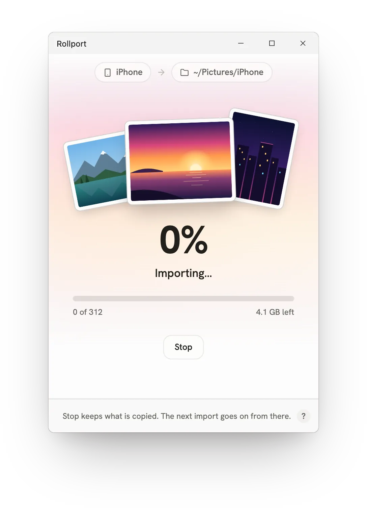

<p align="center">
  <picture>
    <source media="(prefers-color-scheme: dark)" srcset="docs/mark-dark.svg">
    
  </picture>
</p>

<h1 align="center">Rollport</h1>

<p align="center">
  Copy new photos and videos from your iPhone to a folder on your computer, over USB.<br>
  Nothing on the phone is deleted.
</p>

<p align="center">
  <a href="https://artificiadrian.github.io/rollport/">Website</a>
  &nbsp;&nbsp;
  <a href="https://artificiadrian.github.io/rollport/download">Download</a>
  &nbsp;&nbsp;
  <a href="https://artificiadrian.github.io/rollport/help">Help</a>
</p>

<p align="center">
  <picture>
    <source media="(prefers-color-scheme: dark)" srcset="docs/rollport-dark.webp">
    
  </picture>
</p>

## Features

- Copies only new photos and videos, even after you delete or move old ones
- Original files: HEIC, ProRAW, Live Photos, video, GIFs and camera RAW, never converted
- Sorted by date: dated file names, year and month folders, or a pattern of your own
- Choose a date range, and leave out videos, photos or Live Photo videos
- Stop at any time and continue later; unplugging during an import loses nothing
- Remembers each iPhone's folder; drop a folder on the window to switch
- Keyboard: <kbd>⌘</kbd>/<kbd>Ctrl</kbd>+<kbd>Enter</kbd> imports, <kbd>⌘</kbd>/<kbd>Ctrl</kbd>+<kbd>.</kbd> stops,
  <kbd>⌘</kbd>/<kbd>Ctrl</kbd>+<kbd>+</kbd>/<kbd>−</kbd>/<kbd>0</kbd> zooms, <kbd>⌘</kbd><kbd>?</kbd> or <kbd>F1</kbd> opens help
- Windows, macOS and Linux
- Free and open source, no account, works offline

See the [help](https://artificiadrian.github.io/rollport/help) for everything
Rollport does.

## Download

Get the newest version from the
[download page](https://artificiadrian.github.io/rollport/download), or pick a
file here:

| Windows                  | macOS      | Linux                |
| ------------------------ | ---------- | -------------------- |
| [Installer][setup.exe]   | [DMG][dmg] | [AppImage][appimage] |
| [Portable][portable.exe] |            | [DEB][deb]           |
|                          |            | [RPM][rpm]           |

[setup.exe]: https://github.com/artificiadrian/rollport/releases/latest/download/Rollport-setup.exe
[portable.exe]: https://github.com/artificiadrian/rollport/releases/latest/download/Rollport.exe
[dmg]: https://github.com/artificiadrian/rollport/releases/latest/download/Rollport.dmg
[appimage]: https://github.com/artificiadrian/rollport/releases/latest/download/Rollport.AppImage
[deb]: https://github.com/artificiadrian/rollport/releases/latest/download/Rollport.deb
[rpm]: https://github.com/artificiadrian/rollport/releases/latest/download/Rollport.rpm

Older versions are on the
[releases page](https://github.com/artificiadrian/rollport/releases).

- macOS: one DMG for Apple silicon and Intel. The app isn't notarized, so
  macOS blocks it the first time. Allow it in
  System Settings → Privacy & Security.
- Windows: requires [Apple Devices](https://apps.microsoft.com/detail/9np83lwlpz9k)
  (Microsoft Store) or iTunes. The app isn't signed, so SmartScreen warns
  you: More info → Run anyway.
- Linux: requires `usbmuxd` (`apt install usbmuxd` / `dnf install usbmuxd`).
  Make the AppImage runnable first: `chmod +x Rollport.AppImage`.

The iPhone has to be unlocked. The first time you connect it, tap Trust on the
phone. Trust only your own computer, or one you know. [Get started](https://artificiadrian.github.io/rollport/help/getting-started)
has every step for each system.

Rollport imports what is on the iPhone. With Optimize iPhone Storage on, many
originals are only in iCloud;
[download them to the iPhone first](https://artificiadrian.github.io/rollport/help/troubleshooting#icloud).

## Environment variables

Rollport reads these, and sets only the first. A value you set yourself always
wins.

| Variable                                                            | What Rollport does with it                                                                                                                                                       |
| ------------------------------------------------------------------- | -------------------------------------------------------------------------------------------------------------------------------------------------------------------------------- |
| `__NV_DISABLE_EXPLICIT_SYNC`                                        | Linux: set to `1` when the NVIDIA driver is loaded and you have not set it. This stops WebKitGTK's Wayland crash ("Error 71") and keeps the GPU drawing. Set `0` to turn it off. |
| `WEBKIT_DISABLE_DMABUF_RENDERER`, `WEBKIT_DISABLE_COMPOSITING_MODE` | Linux: never set by Rollport. If you set one (to anything but `0`), WebKitGTK draws without the GPU, and Rollport changes screens without animation, which would crash it.       |
| `APPIMAGE`                                                          | Linux: set by the AppImage. Rollport then changes screens without animation, because the AppImage's older WebKitGTK crashes on it.                                               |
| `USBMUXD_SOCKET_ADDRESS`                                            | Where usbmuxd listens: a socket path or `host:port`. The default is `/var/run/usbmuxd`, or `127.0.0.1:27015` on Windows.                                                         |

## Why I made this

The Windows Photos app kept crashing when I imported from my iPhone, and I
never liked using it anyway. I looked for something else and found nothing
that worked the same on Windows, macOS and Linux. So I wrote
[dcimport](https://github.com/artificiadrian/dcimport), a command-line tool,
and then Rollport: the same idea, as an app anyone can use.

## Building

Requirements: [Rust](https://rustup.rs), [Node.js](https://nodejs.org) ≥ 22.18,
[pnpm](https://pnpm.io/installation), and the
[Tauri prerequisites](https://v2.tauri.app/start/prerequisites/).

```sh
pnpm install
pnpm tauri dev
```

`pnpm tauri build` builds the installer. See
[CONTRIBUTING.md](CONTRIBUTING.md) for the rest.

## Licence

MIT

---

iPhone is a trademark of Apple Inc., registered in the U.S. and other
countries and regions. Rollport is not affiliated with or endorsed by Apple.
